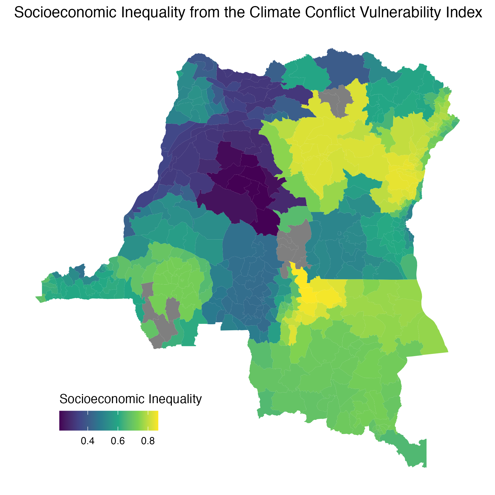
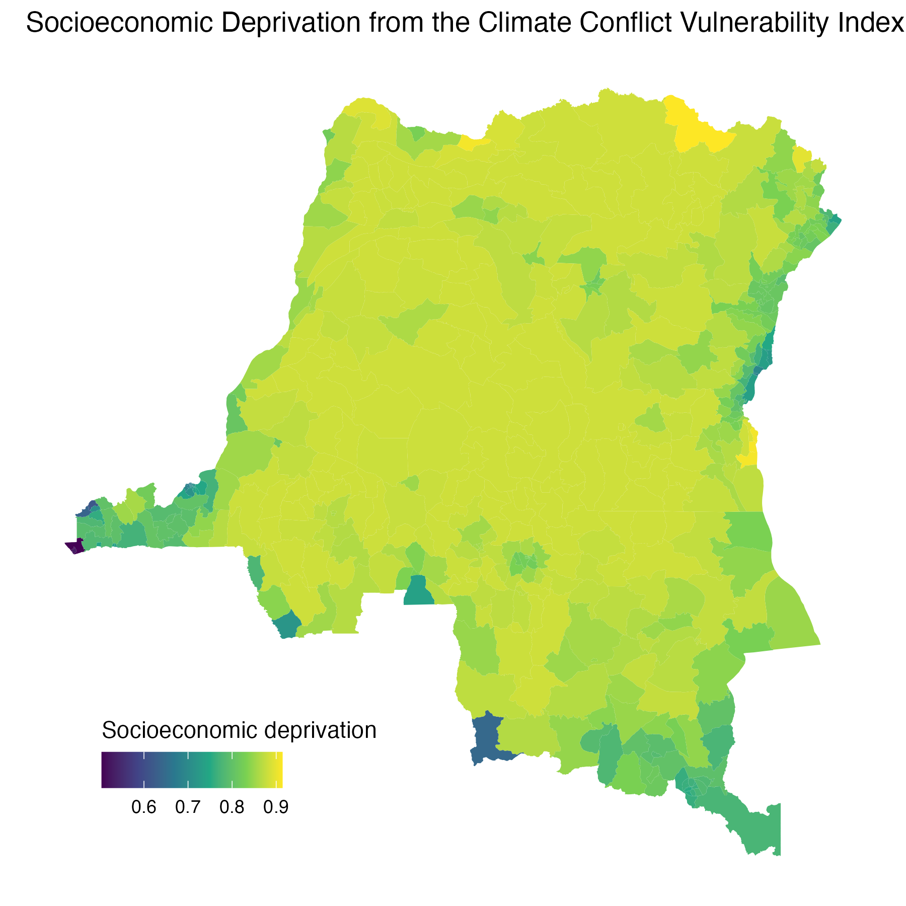

# Climate Conflict Vulnerability Index (CCVI) by health zone

Health-zone-level **socio-economic vulnerability** indicators from the [Climate Conflict Vulnerability Index (CCVI)](https://climate-conflict.org/www), aggregated to `data/shapefiles/DRC_Health_zones.shp`.

These data support outbreak and response analyses where structural vulnerability (deprivation, inequality) may modify exposure to climate- or conflict-related stressors or baseline health-system capacity.



*Socio-economic inequality sub-indicator (CCVI vulnerability pillar). Higher values = greater vulnerability. Generated by `process.R`.*



*Socio-economic deprivation sub-indicator (CCVI vulnerability pillar). Higher values = greater vulnerability. Generated by `process.R`.*

------------------------------------------------------------------------

## About the CCVI

The **Climate Conflict Vulnerability Index** maps where climate and conflict risks overlap with local vulnerability. It is commissioned by the [German Federal Foreign Office](https://www.auswaertiges-amt.de/en) and developed by the University of the Bundeswehr Munich and the Potsdam Institute for Climate Impact Research (PIK). Full methodology: [climate-conflict.org — Methodology](https://climate-conflict.org/www/index/methodology).

### How the index is calculated

The CCVI follows the **IPCC risk framework**: adverse outcomes arise from the interaction of **hazards**, **exposure**, and **vulnerability** (not from hazards alone).

The index is organised in **three pillars**, each built from dimensions and indicators on a global **0.5° grid** (\~55 km), updated **quarterly**:

| Pillar | Role |
|----|----|
| **Climate** | Exposure to climate hazards (recent extremes, seven-year accumulated extremes, ten-year mean shifts); largely satellite-based |
| **Conflict** | Exposure to organised political violence and societal tensions (e.g. ACLED and related sources) |
| **Vulnerability** | Socio-economic, political, demographic, and environmental susceptibility to harm |

**Processing (summary):**

1.  **Acquisition** — Public sources (e.g. Copernicus CDS, ACLED, World Bank) are ingested where possible via APIs.
2.  **Harmonization** — Layers are aligned to a common spatial and temporal grid; indicators are **min–max normalized to 0–1** (higher = higher hazard or vulnerability), with winsorization where needed.
3.  **Exposure** — Hazard indicators are combined with **population density** as the exposure layer (human-security focus).
4.  **Aggregation** — Indicators are combined within dimensions and pillars using **arithmetic, geometric, or quadratic means** (depending on level), with expert weights; climate and conflict **risk** scores combine hazard–exposure with the vulnerability pillar.

**This repository folder** extracts two **vulnerability-pillar** socio-economic sub-indicators (`VUL_socioeconomic_inequality`, `VUL_socioeconomic_deprivation`) for DRC health zones. The committed extract uses the **2024** time slice (last quarter in `COD-2022-2024-ccvi.zs.nc`, time index 11 in `process.R`). Additional CCVI layers exist in the NetCDF but are not exported to CSV here.

------------------------------------------------------------------------

## Files

| File | Description |
|----|----|
| `processed/ccvi__socioeconomic_inequality__static.csv` | Repo contract: `nom`, `socioeconomic_inequality` (519 rows) |
| `processed/ccvi__socioeconomic_deprivation__static.csv` | Repo contract: `nom`, `socioeconomic_deprivation` (519 rows) |
| `processed/COD-2022-2024-ccvi.zs.nc` | Intermediate NetCDF (quarterly 2022–2024; multiple `VUL_*` variables) |
| `socioeconomic_inequality_processed_plot.png` | Choropleth of inequality |
| `socioeconomic_deprivation_processed_plot.png` | Choropleth of deprivation |
| `process.R` | Subset 2024 layer, join to shapefile, plot, write CSVs |
| `metadata.yaml` | Provenance, licence, and pipeline notes |
| `raw/` | Reserved for raw CCVI downloads (currently empty) |

**Coverage:** 519 health zones (national).\
**Temporal scope:** **2024** (latest quarter in the committed NetCDF range 2022–2024).

------------------------------------------------------------------------

## Method (this repo)

1.  **CCVI (upstream)** — Gridded CCVI vulnerability indicators; zonal aggregation to health zones via the [DARTS pipeline](https://dart-pipeline.readthedocs.io/en/latest/) (migration in progress). Current file `COD-2022-2024-ccvi.zs.nc` is from an earlier project.
2.  **Zone geometry** — `data/shapefiles/DRC_Health_zones.shp`; join key `ZSCode` matches `region` in the NetCDF.
3.  **Export (`process.R`)** — Read time index **11** (2024 quarter) for `VUL_socioeconomic_inequality` and `VUL_socioeconomic_deprivation`, join to shapefile, map, write CSVs with `st_drop_geometry()`.

**Units:** Dimensionless scores on **[0, 1]**; **higher = greater vulnerability** (CCVI convention).

------------------------------------------------------------------------

## CSV contract

| Column | Description |
|----|----|
| `nom` | Health-zone name (`Nom` from shapefile) |
| `socioeconomic_inequality` | CCVI socio-economic inequality vulnerability, 2024 |
| `socioeconomic_deprivation` | CCVI socio-economic deprivation vulnerability, 2024 |

`write.csv()` adds a leading `X` column (row index); ignore for analysis.

**Example (R):**

``` r
library(here)

ineq <- read.csv(here("data/ccvi/processed/ccvi__socioeconomic_inequality__static.csv"))
dep  <- read.csv(here("data/ccvi/processed/ccvi__socioeconomic_deprivation__static.csv"))

ineq[ineq$socioeconomic_inequality > 0.85, c("nom", "socioeconomic_inequality")]
```

Join on `nom` with care where names duplicate (**Bili**, **Lubunga**); use `ZSCode` from the shapefile when needed.

------------------------------------------------------------------------

## Regenerating outputs

From the **repository root**:

``` bash
Rscript data/ccvi/process.R
```

**R packages:** `sf`, `dplyr`, `ncdf4`, `terra`, `here`, `ggplot2`.

Overwrites:

-   `processed/ccvi__socioeconomic_inequality__static.csv`
-   `processed/ccvi__socioeconomic_deprivation__static.csv`
-   `socioeconomic_inequality_processed_plot.png`
-   `socioeconomic_deprivation_processed_plot.png`

------------------------------------------------------------------------

## Data quality and limitations

| Issue | Detail |
|----|----|
| **Subset of CCVI** | Only two socio-economic **vulnerability** indicators are exported; not the full climate/conflict pillars or composite risk scores. |
| **2024 snapshot** | One quarterly layer (index 11 in `COD-2022-2024-ccvi.zs.nc`); not a full 2022–2024 time series in the contract CSVs. |
| **Grid → zone** | Values depend on zonal aggregation from 0.5° CCVI grids to health-zone polygons. |
| **Global comparability** | Normalized scores aid cross-region comparison but require validation against local context (see CCVI methodology). |
| **Duplicate `nom`** | Two zones named **Bili** and two **Lubunga**; use `ZSCode` for unambiguous joins. |
| **Pipeline in flux** | Raw CCVI download and DARTS processing are not fully in-repo; NetCDF is the current source of truth. |

------------------------------------------------------------------------

## Provenance

-   **Index:** [Climate Conflict Vulnerability Index (CCVI)](https://climate-conflict.org/www) — [methodology](https://climate-conflict.org/www/index/methodology), [data downloads](https://climate-conflict.org/www/data-pages).
-   **Code (upstream):** [ccew-unibw/ccvi-data](https://github.com/ccew-unibw/ccvi-data) (open source).
-   **Geometry:** `data/shapefiles/DRC_Health_zones.shp`.
-   **Metadata:** `metadata.yaml`.

For project-wide data conventions, see `data/README.md`.
