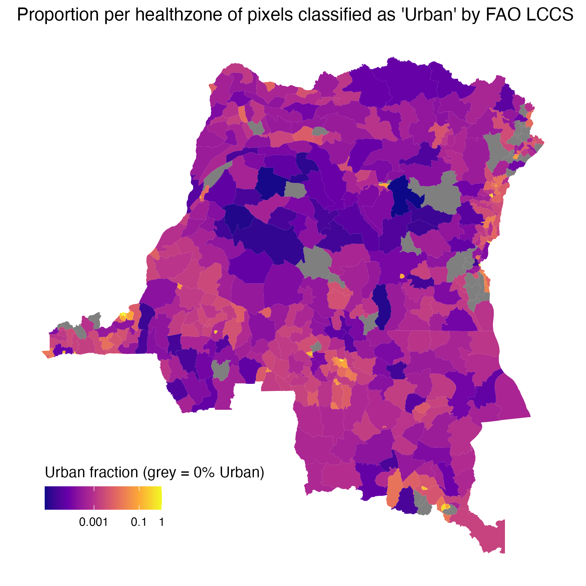

# FAO LCCS urban fraction by health zone

Health-zone-level **urban land-cover fraction** for the Democratic Republic of the Congo (DRC), derived from the Copernicus Climate Data Store (CDS) [**satellite-land-cover**](https://cds.climate.copernicus.eu/datasets/satellite-land-cover) product (UN FAO Land Cover Classification System, LCCS). Values represent the proportion of each zone classified as **urban** (LCCS class **190**).

These data support outbreak and connectivity analyses where built-up environment may modify contact patterns, care-seeking, or interpretation of mobility proxies.



*Proportion of each health zone classified as urban (LCCS code 190). Grey = 0% urban; log₁₀ colour scale for non-zero values. Generated by `process.R`.*

------------------------------------------------------------------------

## Files

| File | Description |
|-----------------------|-------------------------------------------------|
| `processed/fao_lccs__urban_fraction__static.csv` | Repo contract table: `nom`, `urban_fraction` (519 rows) |
| `processed/COD-2022-satellite_land_cover_urban.zs.nc` | Intermediate NetCDF: urban fraction by health-zone code (`ZSCode`), 2022 snapshot |
| `processed_plot.png` | Map of urban fraction by health zone |
| `process.R` | Join NetCDF to shapefile, plot, and write CSV |
| `query_cds_api.py` | Draft CDS API downloader (not yet wired to this folder’s `raw/` layout) |
| `raw/` | Reserved for raw CDS downloads (currently empty) |

**Coverage:** 519 health zones (national), aligned with `data/shapefiles/DRC_Health_zones.shp`.\
**Temporal scope:** Static extract for **2022** (`COD-2022-…`); the NetCDF contains a single time layer.

------------------------------------------------------------------------

## Method

1.  **Land cover (upstream)** — Global 300 m LCCS maps from CDS `satellite-land-cover` (v2.1.1). Urban areas use **class 190**. Full raster processing is intended to run via the [DARTS pipeline](https://dart-pipeline.readthedocs.io/en/latest/); the committed NetCDF is a **2022 health-zone aggregate** produced in an earlier project and reused here while that pipeline is migrated into this repo.
2.  **Zone geometry** — `data/shapefiles/DRC_Health_zones.shp`; join key `ZSCode` (e.g. `CD8308ZS03`) matches `region` in the NetCDF.
3.  **Export (`process.R`)** — Read `lccs_class` (urban fraction, 0–1) from the NetCDF, `left_join` to the shapefile, map with `ggplot2`/`sf`, save `processed_plot.png`, then write a tabular CSV with `st_drop_geometry()` (columns `nom`, `urban_fraction` only).

**Units:** `urban_fraction` is a **proportion** in $[0, 1]$ (0 = no urban pixels in the zone aggregate; 1 = entirely urban).

------------------------------------------------------------------------

## CSV contract

| Column           | Description                                             |
|----------------------------|--------------------------------------------|
| `nom`            | Health-zone name (`Nom` from shapefile)                 |
| `urban_fraction` | Fraction of zone area classified urban (LCCS 190), 2022 |

**Example (R):**

``` r
library(here)

urban <- read.csv(here("data/fao_lccs/processed/fao_lccs__urban_fraction__static.csv"))
urban[urban$urban_fraction > 0.1, ]
```

For spatial joins or maps, use `data/shapefiles/DRC_Health_zones.shp` on `nom` (or `ZSCode` where names are duplicated).

Join to other repo tables on `nom` (mind duplicate zone names in the shapefile: **Bili**, **Lubunga** — see `data/shapefiles/README.md`).

------------------------------------------------------------------------

## Regenerating outputs

From the **repository root**:

``` bash
# Optional: fetch raw CDS tiles (requires ~/.cdsapirc credentials; script paths still being aligned)
python3 data/fao_lccs/query_cds_api.py download --start_year 2022 --end_year 2022

# Rebuild plot and CSV from committed NetCDF
Rscript data/fao_lccs/process.R
```

**R packages:** `sf`, `dplyr`, `ncdf4`, `terra`, `here`, `ggplot2`.\
**Python (download only):** `cdsapi`, `fire` (see `query_cds_api.py`).

------------------------------------------------------------------------

## Data quality and limitations

| Issue | Detail |
|----------------------------------|--------------------------------------|
| **Static year** | Values reflect the **2022** land-cover layer only; not a time series in this folder. |
| **Raster → zone** | Fractions are aggregated to health-zone polygons (exact zonal statistics depend on the upstream DARTS/raster workflow). |
| **Urban definition** | Binary LCCS class 190 only; informal settlements or peri-urban fringe may be misclassified relative to local knowledge. |
| **Duplicate `nom`** | Two zones share the name **Bili** and two **Lubunga**; use `ZSCode` from the shapefile for unambiguous joins. |
| **Pipeline in flux** | Raw CDS download and DARTS processing are not fully reproducible from this repo yet; `processed/COD-2022-satellite_land_cover_urban.zs.nc` is the current source of truth for regeneration. |

------------------------------------------------------------------------

## Provenance

-   **Dataset:** Copernicus CDS `satellite-land-cover` (FAO LCCS, 300 m, annual).
-   **Geometry:** `data/shapefiles/DRC_Health_zones.shp`.
-   **Metadata:** `metadata.yaml`.

For project-wide data conventions, see `data/README.md`.
