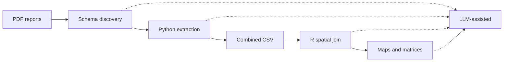

# Flowminder.org mobility/population displacement estimates

This directory contains monthly reports and the extracted data from Flowminder mobility/population displacement estimates, produced from Vodacom RDC CDR data.

The following section contains a detailed log on the pipeline used to extract data from the relevant tables in the PDF province-level reports.

# Log - PDF mobility data extraction workflow

**Log date:** 20 May 2026  
**Documents processed:**

| Province   | PDF file |
|-----------|----------|
| Ituri     | [`estimations_population-mobilite-_ituri_mars2026.pdf`](https://www.flowminder.org/media/yabhszz0/estimations_population-mobilite-_ituri_mars2026.pdf) |
| Nord-Kivu | [`estimations_population-mobilite-_nord-kivu_mars2026.pdf`](https://www.flowminder.org/media/krekplgz/estimations_population-mobilite-_nord-kivu_mars2026.pdf) |
| Haut-Uele | [`estimations_population-mobilite-_haut-uele_mars2026.pdf`](https://www.flowminder.org/media/izuleilq/estimations_population-mobilite-_haut-uele_mars2026.pdf) |
| Tshopo    | [`estimations_population-mobilite-_tshopo_mars2026.pdf`](https://www.flowminder.org/media/pwejomrq/estimations_population-mobilite-_tshopo_mars2026.pdf) |

---

## 1. Objective

Extract structured mobility tables (origin/destination health zones and person counts) from Flowminder provincial reports, validate table numbering and schema, combine provinces into one dataset, and produce OD matrices and maps for outbreak and mobility analysis.

---

## 2. Workflow overview

---

## 3. Step-by-step process

### 3.1 Initial schema discovery (Ituri PDF)

**Tool:** `pdfplumber` (Python), page text and `extract_tables()`  
**Script evolution:** `extract_mobilite_flux_tables.py` (initially Ituri-only)

**Identified pattern:**

- Mobility tables use section numbers **X.1** (arrivals) and **(X+1).1** (departures), with a **gap of 2** between pairs: 5.1/6.1, 9.1/10.1, 13.1/14.1, …
- Each table has **four French columns:** province and health zone (origin or destination), mobility estimate, net migratory balance for the connection.
- Page header: `Zone de santé: <name>` and `Province : <name>`.
- **Inflow:** origins → reporting zone; **outflow:** reporting zone → destinations.
- Values in the mobility column are **sums of the `EVENTS` field** (person counts), not row counts.

**Validation (Ituri):** 62 tables (31 inflow + 31 outflow), 618 rows, numbering pattern complete.

**Role of LLMs:** An **AI coding agent (Cursor / Claude)** interpreted the user’s description of the PDF layout, probed pages 5–14 with `pdfplumber`, confirmed the X.1 numbering rule and four-column schema, and drafted the first extraction script. No LLM read the PDF directly; all table content came from programmatic extraction.

---

### 3.2 Extension to four provinces

**Action:** Same script extended with `PDF_CONFIG` for all four PDFs; output `mobilite_flux_importants_all_provinces_mars2026.csv`.

**Results:**

| Province   | Rows | Tables with data | Empty mobility pages* |
|-----------|------|------------------|------------------------|
| Ituri     | 618  | 62               | 0                      |
| Nord-Kivu | 283  | 38               | 6                      |
| Haut-Uele | 274  | 24               | 0                      |
| Tshopo    | 202  | 32               | 2                      |
| **Total** | **1377** | **156**      | **8**                  |

\*Pages with section X.1 but text “Pas d’estimation des arrivées/départs importantes” and no table (flows ≤100 persons only).

**Validation notes:** Nord-Kivu pages 6, 22, 46, 62, 86, etc. are **valid empty tables**, not extraction failures. Regex for empty pages updated to handle apostrophe variants (`d'arrivées` / `d.part`).

**Role of LLMs:** The agent **mapped user requirements** to multi-file config, **ran validation scans** across PDFs, and **adjusted** `has_no_flow_data()` after false-positive “missing table” warnings.

---

### 3.3 Spatial plotting (R)

**Inputs:**

- Combined CSV  
- `DRC_Health_zones.shp` (health zone polygons)  
- Suspected/confirmed cases by health zone (May 16)
- Province extent: Nord-Kivu, Ituri, Haut-Uele, western Tshopo (lon ≤ 26.75°, includes Makiso-Kisangani)

**Script:** `plot_mobilite_od_maps.R` (not currently in this repository)

**Steps:**

1. Join mobility flows to zone centroids (shapefile), with name aliases (e.g. Mongbwalu → Mongbalu, Nyankunde → Nyakunde).
2. Build province boundaries by **dissolving health zones** (admin shapefiles in `Democratic_Republic_of_the_Congo/` are OSM facility points, not province polygons).
3. Choropleth: suspected/confirmed cases; grey = zero cases; white = zones outside study provinces in crop.
4. Flow lines: viridis, log₁₀ scale; **outflow** full opacity from Ebola-case zones, others subdued (α = 0.12).
5. Full and zoomed maps (Haut-Uele / Ituri / Nord-Kivu only).

**Role of LLMs:** The agent **designed ggplot/sf logic**, debugged geometry (`st_make_valid`, `sf_use_s2(FALSE)`), fixed dplyr/scoping bugs, and implemented **iterative styling** from user feedback (legends, captions, zoom, log scale). Plots were **not** generated by image models; they are reproducible script output.

---

## 4. Key files produced

| File | Description |
|------|-------------|
| `mobilite_flux_importants_ituri_mars2026.csv` | Ituri-only extract (superseded for maps) |
| `mobilite_flux_importants_all_provinces_mars2026.csv` | Combined four-province extract |
| `extract_mobilite_flux_tables.py` | PDF table extraction |
| `plot_mobilite_od_maps.R` | Maps and OD matrices |
| `mobilite_od_matrix_inflow.csv` / `mobilite_od_matrix_outflow.csv` | Pairwise matrices |
| `mobilite_pdf_extraction_log.md` | This log |

---

## 5. LLM involvement summary

| Stage | Human role | Automated tools | LLM role |
|-------|------------|-----------------|----------|
| Requirements | Defined provinces, schema, map style | — | Clarified intent from chat history |
| PDF discovery | — | `pdfplumber`, shell | Inferred table numbering and column semantics |
| Extraction code | Review | Python script execution | Wrote and debugged `extract_mobilite_flux_tables.py` |
| Validation | — | Regex, row counts | Interpreted validation output; fixed empty-page detection |
| Spatial data | — | `sf`, `readxl`, shapefile | Wrote `plot_mobilite_od_maps.R`; alias matching |
| Visualization | Aesthetic feedback | `ggplot2` | Implemented palettes, captions, zoom, log scale |
| This log | — | — | Authored documentation of workflow and LLM touchpoints |

**Important:** **Numerical table data in the CSV were not typed or guessed by an LLM.** They were extracted with `pdfplumber` from PDF table objects. LLMs contributed **code, validation logic, map design, translation of narrative Annex text, and documentation**.

---

## 6. Limitations and reproducibility

1. **PDF tables only:** Flows &gt;100 persons per connection; max ~20 rows per table.  
2. **Name matching:** Shapefile names may differ from PDF labels (manual aliases in R).  
3. **CDR coverage:** Zones listed in each PDF Annex as “non disponibles” are excluded from Flowminder outputs.  
4. **Re-run extraction:** `python3 extract_mobilite_flux_tables.py`  
5. **Re-run maps:** `Rscript plot_mobilite_od_maps.R`

---

## 7. Contact in source documents

Flowminder DRC: **rdc@flowminder.org** (as stated in PDF Annex references).
