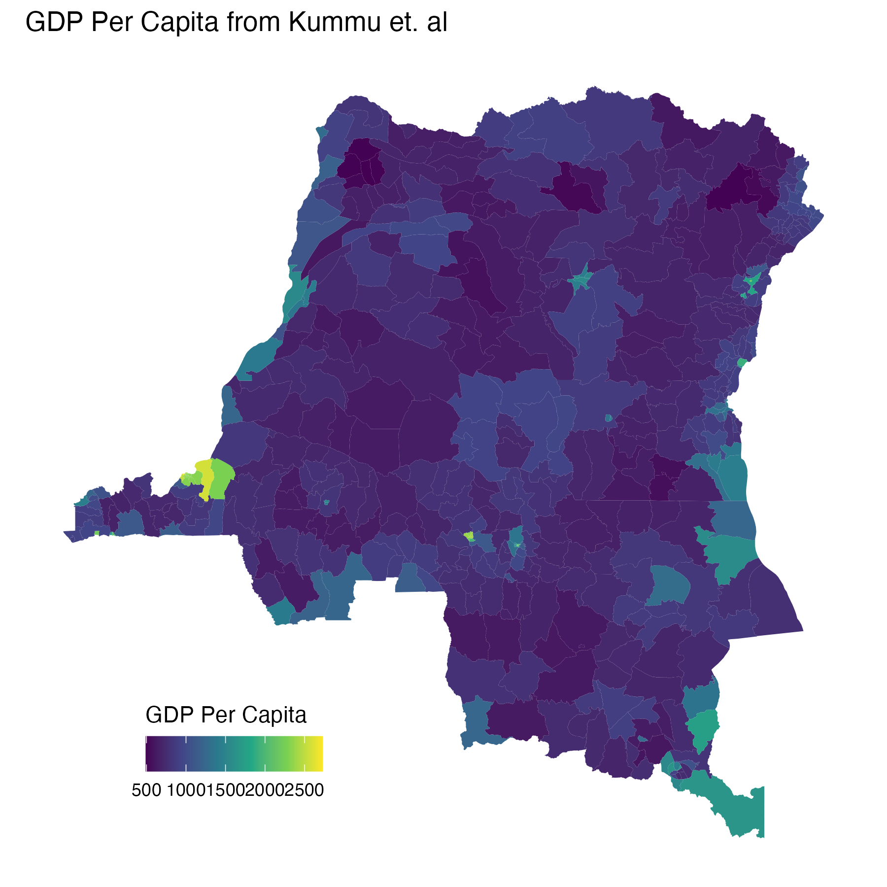

# GDP per capita by health zone (Kummu et al.)

Health-zone-level **gross domestic product (GDP) per capita** for the Democratic Republic of the Congo (DRC), from the downscaled global dataset of [Kummu et al. (2025)](https://www.nature.com/articles/s41597-025-04487-x), aggregated to `data/shapefiles/DRC_Health_zones.shp`.

These data support outbreak and response analyses where economic capacity may influence care infrastructure, mobility, or vulnerability proxies.



*GDP per capita (PPP) per health zone, 2022. Generated by `process.R`.*

---

## About the source dataset

**Paper:** Kummu, M., Kosonen, M. & Masoumzadeh Sayyar, S. *Downscaled gridded global dataset for gross domestic product (GDP) per capita PPP over 1990–2022.* Scientific Data **12**, 178 (2025).  
**DOI:** [10.1038/s41597-025-04487-x](https://doi.org/10.1038/s41597-025-04487-x)  
**Data:** [Zenodo 10.5281/zenodo.10976733](https://doi.org/10.5281/zenodo.10976733)

The dataset provides harmonised, gap-filled **GDP per capita at purchasing power parity (PPP)** for 1990–2022 at national (admin 0), provincial (admin 1), and municipality (admin 2) levels, plus 5 arc-minute grids. It updates earlier subnational GDP products (e.g. Kummu et al. 2018) with longer temporal coverage and finer spatial disaggregation.

### How it is calculated (summary)

1. **National (admin 0)** — GDP per capita (PPP) from World Bank, IMF, and CIA sources (preference in that order), in **2017 international USD**. Missing years are gap-filled via linear interpolation and a regression-based extrapolation using geographically similar countries with complete series.
2. **Subnational (admin 1)** — Reported provincial GDP per capita (PPP) for 89 countries (2,708 units); subnational-to-national ratios are interpolated/extrapolated and combined with national totals so subnational sums align with national GDP.
3. **Admin 2 downscaling** — Admin 1 ratios are disaggregated to ~43,501 admin-2 units using **machine-learning** models (boosted ensemble trees; predictors include urbanisation, travel time to cities, inequality, and national GDP), validated against held-out reported data (R² ≈ 0.79–0.80).

**DRC note:** Subnational **reported** GDP data are sparse in Africa in this product; DRC health-zone values here rely primarily on **downscaled** admin-2/grid estimates rather than direct subnational reporting. Interpret within-country patterns with caution.

**This repository folder** uses the **2022** layer (`COD-2022-gdp_pc.zs.nc`), zonal-aggregated to 519 health zones.

---

## Files

| File | Description |
|------|-------------|
| `processed/gdp_pc__gdp_pc__static.csv` | Repo contract: `nom`, `gdp_pc` (519 rows) |
| `processed/COD-2022-gdp_pc.zs.nc` | Intermediate NetCDF (`gdp_pc` by `ZSCode`) |
| `gdp_pc_processed_plot.png` | Choropleth of GDP per capita |
| `process.R` | Join NetCDF to shapefile, plot, write CSV |
| `metadata.yaml` | Provenance, licence, and pipeline notes |
| `raw/` | Reserved for raw downloads (currently empty) |

**Coverage:** 519 health zones (national).  
**Temporal scope:** **2022** (single time layer in the committed NetCDF).

---

## Method (this repo)

1. **GDP (upstream)** — Gridded / admin-2 GDP per capita (PPP) from Kummu et al.; aggregated to health zones via the [DARTS pipeline](https://dart-pipeline.readthedocs.io/en/latest/) (migration in progress). `COD-2022-gdp_pc.zs.nc` is from an earlier project.
2. **Zone geometry** — `data/shapefiles/DRC_Health_zones.shp`; join on `ZSCode` = `region` in the NetCDF.
3. **Export (`process.R`)** — Read `gdp_pc`, join to shapefile, map, write CSV with `st_drop_geometry()`.

**Units:** `gdp_pc` is **2017 international USD per capita (PPP)**.

---

## CSV contract

| Column | Description |
|--------|-------------|
| `nom` | Health-zone name (`Nom` from shapefile) |
| `gdp_pc` | GDP per capita (PPP), 2022 |

`write.csv()` adds a leading `X` column (row index); ignore for analysis.

**Example (R):**

```r
library(here)

gdp <- read.csv(here("data/gdp_pc/processed/gdp_pc__gdp_pc__static.csv"))
gdp[gdp$gdp_pc > 1500, c("nom", "gdp_pc")]
```

Join on `nom` with care where names duplicate (**Bili**, **Lubunga**); use `ZSCode` from the shapefile when needed.

---

## Regenerating outputs

From the **repository root**:

```bash
Rscript data/gdp_pc/process.R
```

**R packages:** `sf`, `dplyr`, `ncdf4`, `terra`, `here`, `ggplot2`.

Overwrites:

- `processed/gdp_pc__gdp_pc__static.csv`
- `gdp_pc_processed_plot.png`

---

## Data quality and limitations

| Issue | Detail |
|-------|--------|
| **Downscaled estimates** | DRC subnational reporting in the source product is limited; values are model-downscaled, not census-derived at health-zone scale. |
| **Static year** | Single **2022** snapshot; not a 1990–2022 time series in the contract CSV. |
| **Grid → zone** | Values depend on zonal aggregation from admin-2 / 5 arc-minute grids to health-zone polygons. |
| **PPP base year** | Figures are in **2017 international USD (PPP)**; not current nominal USD. |
| **Duplicate `nom`** | Two zones named **Bili** and two **Lubunga**; use `ZSCode` for unambiguous joins. |
| **Pipeline in flux** | Raw download and DARTS processing are not fully in-repo; NetCDF is the current source of truth. |

---

## Provenance

- **Dataset:** [Kummu et al. (2025)](https://www.nature.com/articles/s41597-025-04487-x) — [Zenodo](https://doi.org/10.5281/zenodo.10976733).
- **Geometry:** `data/shapefiles/DRC_Health_zones.shp`.
- **Metadata:** `metadata.yaml`.

For project-wide data conventions, see `data/README.md`.
