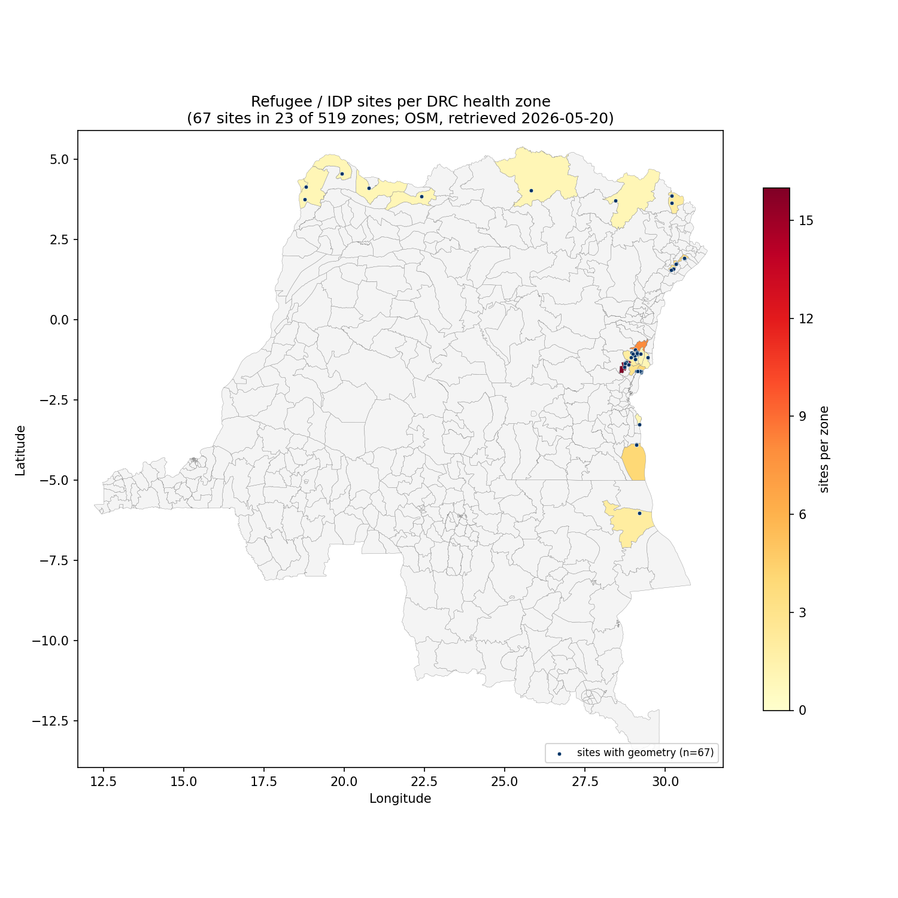

# refugee_sites

Counts of refugee / IDP site locations in the DRC, aggregated from OpenStreetMap to the canonical health-zone (`Nom`) grain.



## What the raw data is

`raw/drc_refugee_sites.geojson` and `raw/drc_refugee_sites.csv` are an extract of OSM features in the DRC tagged with `category=refugee_site` (a few are tagged `refugee_shelter`). Each row/feature represents one camp or shelter, with OSM identifiers, optional `name`, `alt_name`, `capacity`, `population`, `start_date`, `end_date`, `ref_unhcr`, and a geometry.

There are **88 features** in total:

| `osm_type` | count | geometry in raw     |
| ---------- | ----- | ------------------- |
| `node`     | 13    | Point               |
| `way`      | 54    | Polygon             |
| `relation` | 21    | **null** (see below)|

The CSV is a flattened view of the GeoJSON. `lat`/`lon` are populated for nodes and ways but **empty for all 21 relations** — the upstream extraction did not resolve relation geometries. The GeoJSON has the same gap (`geometry: null` for those 21 features).

## How `process.py` aggregates to health zones

1. Reads `raw/drc_refugee_sites.geojson` (the GeoJSON, not the CSV, because the CSV alone is not enough — see "Issues" below).
2. For every feature with a non-null geometry: takes the geometry as-is for Points, and the centroid for Polygons.
3. Runs point-in-polygon against `data/shapefiles/DRC_Health_zones.shp`. The canonical `Nom` (with disambiguation for collisions like `Bili (Nord-Ubangi)`) is taken from the containing health-zone polygon.
4. If a point falls outside every health-zone polygon (e.g. just over a border), it is snapped to the nearest zone and also written to `fallback_points.csv` for inspection.
5. The per-zone counts are written to `processed/refugee_sites__sites__static.csv` with columns `nom, sites`.

The current run produces **23 zones with at least one site**, total **67 sites** across the country, **0 fallback points**, and **21 features dropped** for null geometry.

## Issues with the processing

- **21 OSM relations have null geometry in the upstream extract.** These are documented in `skipped_features.csv` (`osm_type, osm_id, name`) and excluded from the per-zone counts. If you need them, the OSM relation IDs are listed there and can be re-resolved against the OSM API.
- **Polygons are reduced to their centroid for the point-in-polygon step.** A site that straddles a health-zone boundary will only be counted in the zone containing its centroid. This is fine for the small camps in the data, but worth re-checking if a future extract has very large polygons.
- **OSM tags are user-contributed and not authoritative.** A site marked `start_date` in 2014 with no `end_date` is still in the data; some entries may be defunct camps that no one has cleaned up upstream. Treat `sites` as a coarse signal of where sites *have been recorded*, not a guaranteed live inventory.

## Caveats for users of the processed data

- **The per-zone count does not weight by capacity or population.** Most rows in the raw data leave both columns blank, so a count is the most populated signal available. If you need a magnitude estimate, derive it yourself from `capacity` / `population` in `raw/drc_refugee_sites.csv`, but expect heavy missingness.
- **Sites are concentrated in eastern DRC** (Nord-Kivu, Sud-Kivu, Ituri provinces — all in or adjacent to the conflict-affected zones that drive the current outbreak response). The largest zone counts are `Masisi` (16), `Kibirizi` (8), and a cluster of four at `Nyiragongo` / `Karisimbi` / `Fizi` / `Fataki` / `Nizi`. Zones outside the east mostly have one or two sites, reflecting both true distribution and uneven OSM mapping density.
- **Static resolution.** The processed file is a snapshot, not a time series. The `start_date` / `end_date` columns in the raw data are sparse and inconsistent; building a time series would require manual cleaning.
- **Build pipeline join.** The processed file conforms to the data contract: it carries a `nom` column with canonical zone names, so it will be merged into `build/drc_health_zones.geojson` by `tools/build_geojson.py` as `feature.properties.refugee_sites.sites`.

## Reproducing

From the repo root, with the project venv active:

```
python data/refugee_sites/process.py     # writes processed/, fallback_points.csv, skipped_features.csv
python data/refugee_sites/map.py         # writes map.png
```
