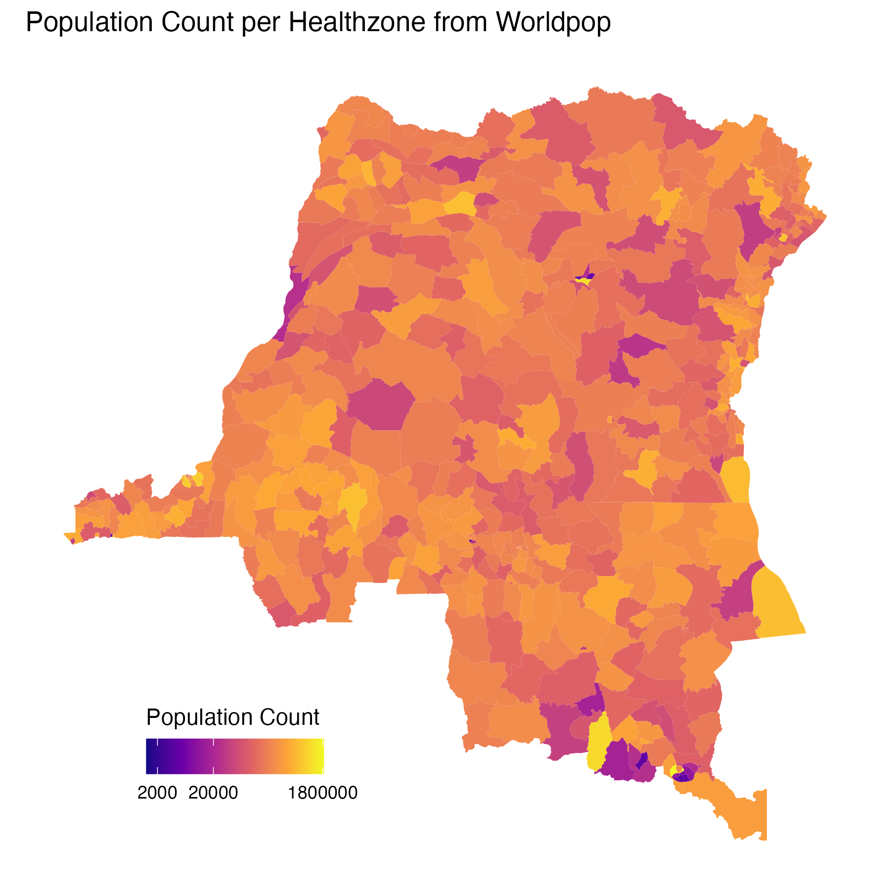
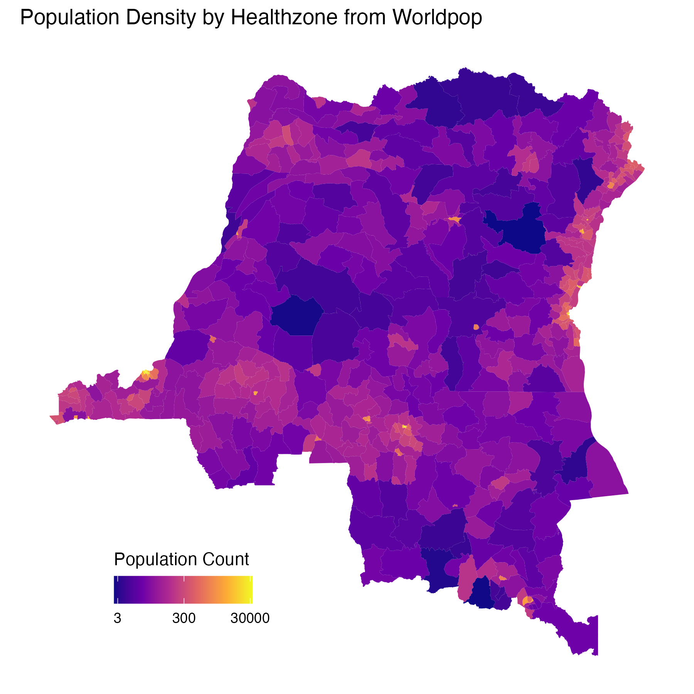

# WorldPop population by health zone

Health-zone-level **population count** and **population density** for the Democratic Republic of the Congo (DRC), derived from [WorldPop](https://www.worldpop.org/) gridded population estimates and aggregated to `data/shapefiles/DRC_Health_zones.shp`.

These data support outbreak modelling where total population or settlement pressure may scale transmission risk, care demand, or movement proxies.



*Total population per health zone (WorldPop). Log₁₀ colour scale. Generated by `process.R`.*



*Population density per health zone (people per km²). Log₁₀ colour scale. Generated by `process.R`.*

------------------------------------------------------------------------

## Files

| File | Description |
|----|----|
| `processed/worldpop__pop_count__static.csv` | Repo contract table: `nom`, `pop_count` (519 rows) |
| `processed/worldpop__pop_density__static.csv` | Repo contract table: `nom`, `pop_density` (people per km²) |
| `processed/COD-2025-population.zs.nc` | Intermediate NetCDF: `pop_count`, `area`, `pop_density` by health-zone code (`region` = `ZSCode`) |
| `popcount_processed_plot.png` | Choropleth of population count |
| `popdensity_processed_plot.png` | Choropleth of population density |
| `process.R` | Join NetCDF to shapefile, plot, and write CSVs |
| `metadata.yaml` | Provenance, licence, and pipeline notes |
| `raw/` | Reserved for raw WorldPop downloads (currently empty) |

**Coverage:** 519 health zones (national), aligned with `data/shapefiles/DRC_Health_zones.shp`.\
**Temporal scope:** Static extract for **2025** (`COD-2025-…`); the NetCDF contains a single time layer.

------------------------------------------------------------------------

## Method

1.  **Population (upstream)** — WorldPop gridded population surfaces for DRC, zonal statistics aggregated to health zones. Full raster processing is intended to run via the [DARTS pipeline](https://dart-pipeline.readthedocs.io/en/latest/); the committed NetCDF is a **2025 health-zone aggregate** produced in an earlier project and reused here while that pipeline is migrated into this repo.
2.  **Zone geometry** — `data/shapefiles/DRC_Health_zones.shp`; join key `ZSCode` (e.g. `CD8308ZS03`) matches `region` in the NetCDF.
3.  **Export (`process.R`)** — Read `pop_count` and `pop_density` from the NetCDF, `left_join` to the shapefile, map with `ggplot2`/`sf`, save plots, then write tabular CSVs with `st_drop_geometry()`.

**Units**

| Variable | Unit | Description |
|----|----|----|
| `pop_count` | people | Total population in the health zone |
| `pop_density` | people per km² | `pop_count` / zone area (from NetCDF variable `area`, km²) |

------------------------------------------------------------------------

## CSV contract

| Column        | Description                               |
|---------------|-------------------------------------------|
| `nom`         | Health-zone name (`Nom` from shapefile)   |
| `pop_count`   | Total population, 2025 WorldPop aggregate |
| `pop_density` | Population density (people per km²)       |

`write.csv()` also adds a leading `X` column (row index); ignore it for analysis.

**Example (R):**

``` r
library(here)

pop <- read.csv(here("data/worldpop/processed/worldpop__pop_count__static.csv"))
dens <- read.csv(here("data/worldpop/processed/worldpop__pop_density__static.csv"))

pop[pop$pop_count > 500000, c("nom", "pop_count")]
```

Join to other repo tables on `nom` (mind duplicate zone names: **Bili**, **Lubunga** — use `ZSCode` from the shapefile where names are ambiguous).

------------------------------------------------------------------------

## Regenerating outputs

From the **repository root**:

``` bash
Rscript data/worldpop/process.R
```

**R packages:** `sf`, `dplyr`, `ncdf4`, `terra`, `here`, `ggplot2`.

Outputs are overwritten:

-   `processed/worldpop__pop_count__static.csv`
-   `processed/worldpop__pop_density__static.csv`
-   `popcount_processed_plot.png`
-   `popdensity_processed_plot.png`

------------------------------------------------------------------------

## Data quality and limitations

| Issue | Detail |
|----|----|
| **Static year** | Values reflect the **2025** WorldPop layer in `COD-2025-population.zs.nc`; not a time series in this folder. |
| **Raster → zone** | Counts and densities depend on the upstream DARTS/zonal-statistics workflow (how grid cells intersect zone polygons). |
| **Modelled population** | WorldPop estimates are model-based, not census counts at zone level; uncertainty is not included in these tables. |
| **Duplicate `nom`** | Two zones share the name **Bili** and two **Lubunga**; use `ZSCode` from the shapefile for unambiguous joins. |
| **Pipeline in flux** | Raw WorldPop download and DARTS processing are not fully reproducible from this repo yet; `processed/COD-2025-population.zs.nc` is the current source of truth for regeneration. |

------------------------------------------------------------------------

## Provenance

-   **Dataset:** [WorldPop](https://www.worldpop.org/) gridded population estimates, DRC.
-   **Geometry:** `data/shapefiles/DRC_Health_zones.shp`.
-   **Metadata:** `metadata.yaml`.

For project-wide data conventions, see `data/README.md`.
